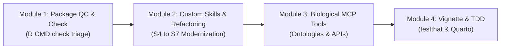

# Introducing Agentic Coding for Bioconductor: Hands-On Exercises

**Bioconductor DevDay 2026**  
**Activity Leader:** Vince Carey  
**Reference Material:** [AI Agents for Bioconductor and R (Sean Davis)](https://talks.seandavis.net/2026-07-31-harvard-agents/#/title-slide)

---

## Executive Summary

Agentic coding transitions developers from interactive chat interfaces to automated, file-aware coding workflows. In an agentic setup, the AI model directly inspects project files, runs terminal commands (such as `R CMD check` or `testthat`), parses error output, and iteratively modifies code until specifications are met.

This document outlines four progressive hands-on exercises designed for Bioconductor package developers, maintainers, and computational biologists during DevDay 2026.

---

## Key Core Concepts

1. **Work is File-Shaped**: Agents operate directly on files in a local directory rather than exchanging isolated code snippets in a browser.
2. **Context Window Management**: Using Markdown files (`PLAN.md`, `NOTES.md`) as structured external memory so agents maintain state across multi-step refactoring tasks.
3. **Modular Skills vs. Monolithic Prompts**: Equipping agents with specialized instruction files (`SKILL.md`) to enforce project coding standards (e.g., Bioconductor guidelines).
4. **Model Context Protocol (MCP)**: Connecting agents to biological databases and ontologies (e.g., EMBL-EBI OLS) via standardized tool-calling interfaces to prevent hallucination.

---

## Workflow Roadmap



---

## Hands-On Workshop Modules

### Module 1: Automated Package QC & `R CMD check` Triage
* **Level**: Beginner
* **Objective**: Experience autonomous iterative debugging where the agent reads logs, edits source files, and verifies fixes without manual intervention.
* **Setup**: A sample R package containing common `R CMD check` warnings/errors (e.g., missing `@param` tags in roxygen2 documentation, undeclared dependencies in `DESCRIPTION`, or unregistered S4 methods).
* **Sample Prompt**:
  > *"Run `R CMD check` in the current workspace. Parse the check log, identify all warnings and errors, inspect the relevant source files, apply exact code fixes, and re-run check until 0 errors and 0 warnings remain."*
* **Learning Outcomes**:
  - Understand how agents invoke shell tools and process terminal output.
  - Observe how agents resolve roxygen2, `NAMESPACE`, and `DESCRIPTION` discrepancies.

---

### Module 2: Custom Skills & S4-to-S7 Refactoring
* **Level**: Intermediate
* **Objective**: Learn how custom Agent Skills (`SKILL.md` or `.gemini/skills/`) steer code generation according to Bioconductor standards.
* **Setup**: A legacy S4 class implementation (or `SummarizedExperiment` derivative) requiring modern object-oriented refactoring.
* **Sample Prompt**:
  > *"Read `.gemini/skills/bioc-style-guide/SKILL.md`. Refactor the legacy S4 class in `R/AllClasses.R` into a modern S7 class definition. Ensure all method dispatches are preserved and vectorized operations use `BiocParallel` where appropriate."*
* **Learning Outcomes**:
  - Author and customize agent skills for package development.
  - Evaluate how specialized agent instructions improve modern R code generation.

---

### Module 3: Biological Tool Calling & MCP Integration
* **Level**: Advanced
* **Objective**: Integrate external biological infrastructure using Model Context Protocol (MCP) to supply factual context to the agent.
* **Setup**: An agent equipped with an EMBL-EBI Ontology Lookup Service (OLS) MCP server or BioMCP tools.
* **Sample Prompt**:
  > *"Annotate the `rowData` of this `SummarizedExperiment` with standardized Gene Ontology (GO) and Cell Ontology (CL) terms. Do not hallucinate IDs—query the OLS MCP tool to retrieve validated ontology URIs and term labels."*
* **Learning Outcomes**:
  - Connect AI agents to live scientific APIs and database services.
  - Eliminate biological entity hallucination via real-time tool lookup.

---

### Module 4: Test-Driven Development (TDD) & Dynamic Vignettes
* **Level**: Capstone
* **Objective**: Generate robust automated test suites (`testthat`) and executable documentation (`Quarto` / `Rmarkdown`).
* **Setup**: A core data analysis routine from a Bioconductor package.
* **Sample Prompt**:
  > *"1. Create a `testthat` test file for `R/normalizeCounts.R` covering edge cases including NA handling, zero counts, and matrix/SummarizedExperiment inputs. Run `testthat` to verify.*  
  > *2. Generate a Quarto vignette demonstrating a full end-to-end workflow with code chunks and sample visualizations."*
* **Learning Outcomes**:
  - Automate test suite coverage for R packages.
  - Create reproducible documentation with agent assistance.

---

## Technical Prerequisites for Attendees

1. **Agent CLI / IDE**: Install an agentic coding client (such as Google Antigravity CLI `antigravity-cli` or equivalent).
2. **Authentication**: Sign up and authenticate with a free or preferred model tier.
3. **Environment**: Local R installation (>= 4.4) with `devtools`, `roxygen2`, `testthat`, `S7`, and `BiocManager`.
4. **Repository Clone**:
   ```bash
   git clone https://github.com/vjcitn/bioc2026devday.git
   cd bioc2026devday
   ```
